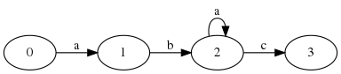

# DFA: generator,converter,checker python

## Deterministic Finite Automaton Generator and converter Python
>  a python program that reads data from a file and creates a DFA machine (5-tuple),generates set of language and checks if the generated language is accepted by the created DFA machine and converts Regular Expression to DFA.   

A deterministic finite automaton M is a 5-tuple, ( Q , Σ , δ , q0 , F ) consisting of 

    a finite set of states Q
    a finite set of input symbols called the alphabet Σ
    a transition function δ : Q × Σ → Q
    an initial or start state q 0 ∈ Q
    a set of accept states F ⊆ Q

##### Package used:
> graphviz 
> PrettyTable 
 

##### Install required package to run the program
> sudo apt-get install graphviz libgraphviz-dev graphviz-dev pkg-config 
> pip install pygraphviz 
> pip install PrettyTable 

##### run the program
> chmod +x dfa.py 
> ./dfa.py 

 

##### Required Input(Initialize DFA):
	set of states Q
		{0,1,2,3}

 

	set of alphabet Σ
		{a,b,c}

 

	transition function δ : Q × Σ → Q
		current state: {0}
		value: {a}
		Target state: {1}

 

	initial or start state q 0 ∈ Q
		{0}

 

	a set of accept states F ⊆ Q
		{1,0}

##### Sample Input from file "data.txt":

##### required Input(Regular Expression to DFA)

	Regular Expression
		ab*+cd

##### Sample run

##### Sample result

##### Sample DFA Diagram Generated:

